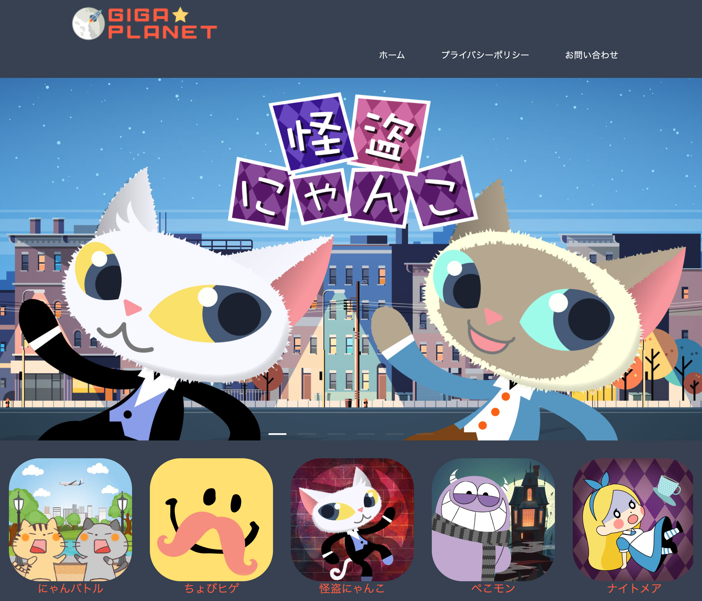
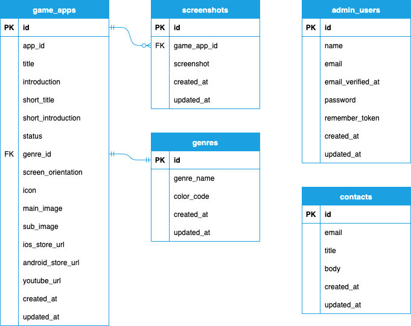

# GIGA★PLANET

## 1. サイト概要

個人で開発した**ゲームアプリ**の**紹介サイト**です。

管理画面では、ゲームアプリとお問い合わせの管理機能があります。

ポートフォリオのサイトも設置しています。

## 2. 使用技術

### フロントエンド
- HTML5
- CSS3、Sass
- Bootstrap5
- Tailwind3
- JavaScript
- Vue.js

### バックエンド
- PHP 7.4.30
- Laravel 8.83.23
- MariaDB 10.5.10

### インフラ
- Docker （開発環境）
- AWS
- Nginx 1.20.0

### その他

- Git / GitHub
- PhpStorm
- Illustrator

## 3. DB設計

### ER 図

### 各テーブル

|    テーブル名    |      説明      |
|:---------------|:--------------|
| game_apps      | ゲームアプリ     |
| screenshots    | スクリーンショット |
| genres         | ゲームジャンル   |
| admin_users    | 管理者          |
| contacts       | 問い合わせ内容    |

## 4. 機能一覧

### ユーザ画面
- **レスポンシブ対応**
- **Swiper**（JSライブラリのスライダー）

### 管理画面
- **ゲームアプリ管理**（CRUD 処理）
- **ジャンル登録**（CRUD 処理）
- **お問い合わせ確認**

### ポートフォリオ
- **レスポンシブ対応**
- **Chart.js**（JSライブラリのグラフ表示）
